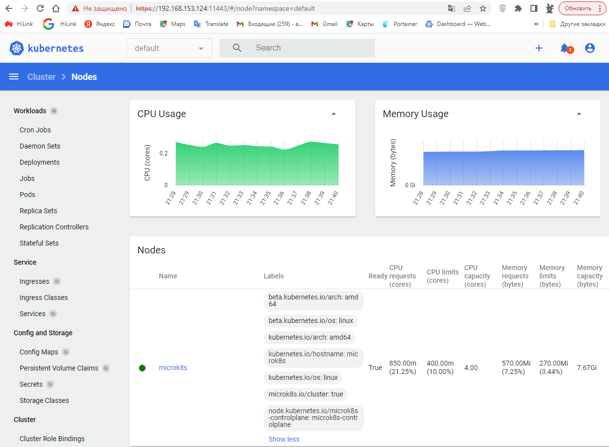
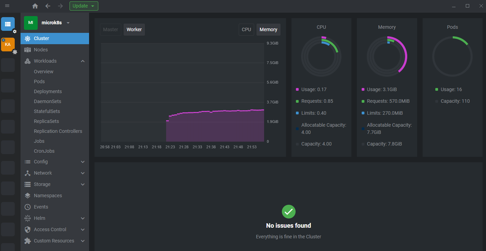

# Домашнее задание к занятию "12.1  "Kubernetes 1.1. Команда kubectl"

## Задание 1 - Установка MicroK8S

1. Установим MicroK8S:

```bash
root@microk8s:~# microk8s kubectl get nodes
NAME       STATUS   ROLES    AGE   VERSION
microk8s   Ready    <none>   60m   v1.26.3

root@microk8s:~# microk8s status --wait-ready
microk8s is running
high-availability: no
  datastore master nodes: 127.0.0.1:19001
  datastore standby nodes: none
addons:
  enabled:
    dashboard            # (core) The Kubernetes dashboard
    dns                  # (core) CoreDNS
    ha-cluster           # (core) Configure high availability on the current node
    helm                 # (core) Helm - the package manager for Kubernetes
    helm3                # (core) Helm 3 - the package manager for Kubernetes
    hostpath-storage     # (core) Storage class; allocates storage from host directory
    metrics-server       # (core) K8s Metrics Server for API access to service metrics
    observability        # (core) A lightweight observability stack for logs, traces and metrics
    storage              # (core) Alias to hostpath-storage add-on, deprecated
  disabled:
    cert-manager         # (core) Cloud native certificate management
    community            # (core) The community addons repository
    gpu                  # (core) Automatic enablement of Nvidia CUDA
    host-access          # (core) Allow Pods connecting to Host services smoothly
    ingress              # (core) Ingress controller for external access
    kube-ovn             # (core) An advanced network fabric for Kubernetes
    mayastor             # (core) OpenEBS MayaStor
    metallb              # (core) Loadbalancer for your Kubernetes cluster
    minio                # (core) MinIO object storage
    prometheus           # (core) Prometheus operator for monitoring and logging
    rbac                 # (core) Role-Based Access Control for authorisation
    registry             # (core) Private image registry exposed on localhost:32000

```

2. Установим dashboard:

```bash
root@microk8s:~# microk8s enable dashboard
Infer repository core for addon dashboard
Addon core/dashboard is already enabled
```

3. Сгенерируем сертификат для подключения к внешнему ip-адресу:

```bash
root@microk8s:~# sudo microk8s refresh-certs --cert front-proxy-client.crt
Taking a backup of the current certificates under /var/snap/microk8s/4959/certs-backup/
Creating new certificates
Signature ok
subject=CN = front-proxy-client
Getting CA Private Key
Restarting service kubelite.

root@microk8s:~# microk8s kubectl port-forward -n kube-system service/kubernetes-dashboard --address 0.0.0.0 11443:443
Forwarding from 0.0.0.0:11443 -> 8443
Handling connection for 11443
Handling connection for 11443

```



## Задание 2 - Установка и настройка локального kubectl

1. Установить на локальную машину kubectl

```bash
root@microk8s:~# kubectl version
WARNING: This version information is deprecated and will be replaced with the output from kubectl version --short.  Use --output=yaml|json to get the full version.
Client Version: version.Info{Major:"1", Minor:"26", GitVersion:"v1.26.3", GitCommit:"9e644106593f3f4aa98f8a84b23db5fa378900bd", GitTreeState:"clean", BuildDate:"2023-03-15T13:40:17Z", GoVersion:"go1.19.7", Compiler:"gc", Platform:"linux/amd64"}
Kustomize Version: v4.5.7
Server Version: version.Info{Major:"1", Minor:"26", GitVersion:"v1.26.3", GitCommit:"9e644106593f3f4aa98f8a84b23db5fa378900bd", GitTreeState:"clean", BuildDate:"2023-03-17T19:59:21Z", GoVersion:"go1.19.7", Compiler:"gc", Platform:"linux/amd64"}
```

2. Настроить локально подключение к кластеру:

```bash
root@microk8s:~# microk8s config > ~/.kube/config
root@microk8s:~# ls -la ~/.kube/config
-rw-r--r-- 1 root root 1877 Apr  4 18:51 /root/.kube/config
```

```bash
root@microk8s:~# kubectl get nodes
NAME       STATUS   ROLES    AGE   VERSION
microk8s   Ready    <none>   78m   v1.26.3

root@microk8s:~# kubectl get pods -A
NAMESPACE       NAME                                                     READY   STATUS    RESTARTS      AGE
kube-system     kubernetes-dashboard-dc96f9fc-jhvgs                      1/1     Running   1 (64m ago)   74m
kube-system     dashboard-metrics-scraper-7bc864c59-s59zz                1/1     Running   1 (64m ago)   74m
kube-system     hostpath-provisioner-69cd9ff5b8-4vf2s                    1/1     Running   0             33m
observability   kube-prom-stack-kube-prome-operator-79cbdd7979-x5vpx     1/1     Running   0             33m
observability   tempo-0                                                  2/2     Running   0             32m
observability   alertmanager-kube-prom-stack-kube-prome-alertmanager-0   2/2     Running   1 (32m ago)   32m
observability   loki-0                                                   1/1     Running   0             32m
observability   prometheus-kube-prom-stack-kube-prome-prometheus-0       2/2     Running   0             32m
observability   kube-prom-stack-kube-state-metrics-5bf874b44d-w4hxm      1/1     Running   0             33m
observability   kube-prom-stack-prometheus-node-exporter-hbzbr           1/1     Running   0             33m
kube-system     metrics-server-6f754f88d-4shfs                           1/1     Running   1 (64m ago)   75m
kube-system     calico-node-r7bpm                                        1/1     Running   1 (64m ago)   78m
observability   loki-promtail-v5f9d                                      1/1     Running   0             32m
kube-system     coredns-6f5f9b5d74-xwlw5                                 1/1     Running   1 (64m ago)   76m
kube-system     calico-kube-controllers-79568db7f8-lxzng                 1/1     Running   1 (64m ago)   78m
observability   kube-prom-stack-grafana-79bff66ffb-s465k                 3/3     Running   0             33m

root@microk8s:~# kubectl cluster-info
Kubernetes control plane is running at https://192.168.153.124:16443
CoreDNS is running at https://192.168.153.124:16443/api/v1/namespaces/kube-system/services/kube-dns:dns/proxy
To further debug and diagnose cluster problems, use 'kubectl cluster-info dump'.

root@microk8s:~# kubectl get nodes -o wide
NAME       STATUS   ROLES    AGE   VERSION   INTERNAL-IP       EXTERNAL-IP   OS-IMAGE             KERNEL-VERSION      CONTAINER-RUNTIME
microk8s   Ready    <none>   79m   v1.26.3   192.168.153.124   <none>        Ubuntu 20.04.6 LTS   5.4.0-146-generic   containerd://1.6.15
```

3. Подключиться к дашборду с помощью port-forward:

```bash
root@microk8s:~# kubectl port-forward -n kube-system service/kubernetes-dashboard --address 0.0.0.0 12443:443
Forwarding from 0.0.0.0:12443 -> 8443
Handling connection for 12443
Handling connection for 12443
Handling connection for 12443
```



