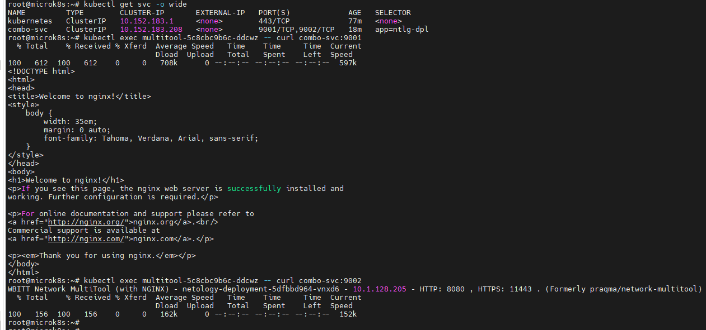
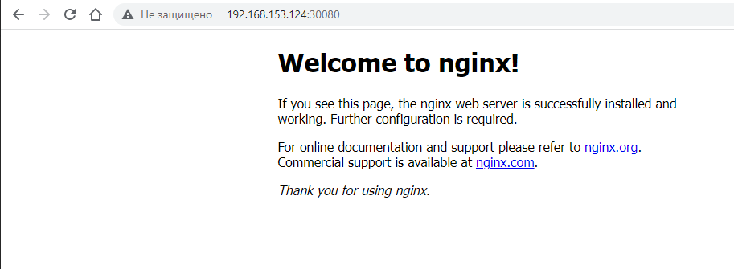
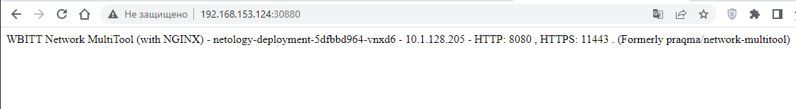

# Домашнее задание к занятию "12.4  "Сетевое взаимодействие в K8S. Часть 1"

## Задание 1 - Deployment и доступ к репликам приложения из другого Pod по разным портам

1. Deployment из двух контейнеров — nginx и multitool с кол-вом реплик 3шт:

[netology-depl.yaml](/kubernetes/netology-depl.yaml)

```bash
root@microk8s:~# kubectl get deployment
NAME                  READY   UP-TO-DATE   AVAILABLE   AGE
netology-deployment   3/3     3            3           7m18s

root@microk8s:~# kubectl describe deployment netology-deployment
Name:                   netology-deployment
Namespace:              default
CreationTimestamp:      Sun, 09 Apr 2023 18:24:58 +0000
Labels:                 app=ntlg-dpl
Annotations:            deployment.kubernetes.io/revision: 1
Selector:               app=ntlg-dpl
Replicas:               3 desired | 3 updated | 3 total | 3 available | 0 unavailable
StrategyType:           RollingUpdate
MinReadySeconds:        0
RollingUpdateStrategy:  25% max unavailable, 25% max surge
Pod Template:
  Labels:  app=ntlg-dpl
  Containers:
   nginx:
    Image:        nginx:1.19.1
    Port:         80/TCP
    Host Port:    0/TCP
    Environment:  <none>
    Mounts:       <none>
   network-multitool:
    Image:       wbitt/network-multitool
    Ports:       1180/TCP, 11443/TCP
    Host Ports:  0/TCP, 0/TCP
    Limits:
      cpu:     10m
      memory:  20Mi
    Requests:
      cpu:     1m
      memory:  20Mi
    Environment:
      HTTP_PORT:   8080
      HTTPS_PORT:  11443
    Mounts:        <none>
  Volumes:         <none>
Conditions:
  Type           Status  Reason
  ----           ------  ------
  Available      True    MinimumReplicasAvailable
  Progressing    True    NewReplicaSetAvailable
OldReplicaSets:  <none>
NewReplicaSet:   netology-deployment-5dfbbd964 (3/3 replicas created)
Events:          <none>
```

2. Service для обеспечения доступа внутри кластера до контейнеров приложения из п.1 по порту 9001 - nginx 80, по 9002 - multitool 8080:

[combo-svc.yaml](/kubernetes/combo-svc.yaml)

```bash
root@microk8s:~# kubectl get svc -o wide
NAME         TYPE        CLUSTER-IP       EXTERNAL-IP   PORT(S)             AGE   SELECTOR
kubernetes   ClusterIP   10.152.183.1     <none>        443/TCP             69m   <none>
combo-svc    ClusterIP   10.152.183.208   <none>        9001/TCP,9002/TCP   10m   app=ntlg-dpl
```

3. Отдельный Pod с приложением multitool для пробы с помощью curl доступа до приложения из п.1 по разным портам в разные контейнеры

[multitool.yaml](/kubernetes/multitool.yaml)

4. Демонстрация доступа с помощью curl по доменному имени сервиса:

```
root@microk8s:~# kubectl get svc -o wide
NAME         TYPE        CLUSTER-IP       EXTERNAL-IP   PORT(S)             AGE     SELECTOR
kubernetes   ClusterIP   10.152.183.1     <none>        443/TCP             62m     <none>
combo-svc    ClusterIP   10.152.183.208   <none>        9001/TCP,9002/TCP   3m10s   app=ntlg-dpl

root@microk8s:~# kubectl exec multitool-5c8cbc9b6c-ddcwz -- curl combo-svc:9001
  % Total    % Received % Xferd  Average Speed   Time    Time     Time  Current
                                 Dload  Upload   Total   Spent    Left  Speed
100   612  100   612    0     0   102k      0 --:--:-- --:--:-- --:--:--  119k
<!DOCTYPE html>
<html>
<head>
<title>Welcome to nginx!</title>
<style>
    body {
        width: 35em;
        margin: 0 auto;
        font-family: Tahoma, Verdana, Arial, sans-serif;
    }
</style>
</head>
<body>
<h1>Welcome to nginx!</h1>
<p>If you see this page, the nginx web server is successfully installed and
working. Further configuration is required.</p>

<p>For online documentation and support please refer to
<a href="http://nginx.org/">nginx.org</a>.<br/>
Commercial support is available at
<a href="http://nginx.com/">nginx.com</a>.</p>

<p><em>Thank you for using nginx.</em></p>
</body>
</html>

root@microk8s:~# kubectl exec multitool-5c8cbc9b6c-ddcwz -- curl combo-svc:9002
  % Total    % Received % Xferd  Average Speed   Time    Time     Time  Current
                                 Dload  Upload   Total   Spent    Left  Speed
100   156  100   156    0     0   170k      0 --:--:-- --:--:-- --:--:--  152k
WBITT Network MultiTool (with NGINX) - netology-deployment-5dfbbd964-g867g - 10.1.128.203 - HTTP: 8080 , HTTPS: 11443 . (Formerly praqma/network-multitool)
```

5. Предоставить манифесты Deployment и Service в решении:

[netology-depl.yaml](/kubernetes/netology-depl.yaml)
[combo-svc.yaml](/kubernetes/combo-svc.yaml)



## Задание 2 - Создать Service и обеспечить доступ к приложениям снаружи кластера

1. Отдельный Service приложения из Задания 1 с возможностью доступа снаружи кластера к nginx, используя тип NodePort:

[ext-combo-svc.yaml](/kubernetes/ext-combo-svc.yaml)

```bash
root@microk8s:~# kubectl apply -f "/root/ext-combo-svc.yaml"
service/ext-combo-svc configured

root@microk8s:~# kubectl get svc -o wide
NAME            TYPE        CLUSTER-IP       EXTERNAL-IP   PORT(S)                         AGE   SELECTOR
kubernetes      ClusterIP   10.152.183.1     <none>        443/TCP                         89m   <none>
combo-svc       ClusterIP   10.152.183.208   <none>        9001/TCP,9002/TCP               30m   app=ntlg-dpl
ext-combo-svc   NodePort    10.152.183.134   <none>        9001:30080/TCP,9002:30880/TCP   72s   app=ntlg-dpl
```

2. Демонстрация доступа с помощью браузера или curl с локального компьютера.

```bash
root@microk8s:~# ip a |grep eth0
2: eth0: <BROADCAST,MULTICAST,UP,LOWER_UP> mtu 1500 qdisc fq_codel state UP group default qlen 1000
    inet 192.168.153.124/24 brd 192.168.153.255 scope global dynamic eth0
```

- nginx



- mtools



3. Манифест и Service в решении, а также скриншоты или вывод команды п.2:

[ext-combo-svc.yaml](/kubernetes/ext-combo-svc.yaml)

```bash
aleksturbo@AlksTrbNoute:~$ curl http://192.168.153.124:30880
WBITT Network MultiTool (with NGINX) - netology-deployment-5dfbbd964-g867g - 10.1.128.203 - HTTP: 8080 , HTTPS: 11443 . (Formerly praqma/network-multitool)

aleksturbo@AlksTrbNoute:~$ curl http://192.168.153.124:30080
<!DOCTYPE html>
<html>
<head>
<title>Welcome to nginx!</title>
<style>
    body {
        width: 35em;
        margin: 0 auto;
        font-family: Tahoma, Verdana, Arial, sans-serif;
    }
</style>
</head>
<body>
<h1>Welcome to nginx!</h1>
<p>If you see this page, the nginx web server is successfully installed and
working. Further configuration is required.</p>

<p>For online documentation and support please refer to
<a href="http://nginx.org/">nginx.org</a>.<br/>
Commercial support is available at
<a href="http://nginx.com/">nginx.com</a>.</p>

<p><em>Thank you for using nginx.</em></p>
</body>
</html>
```
