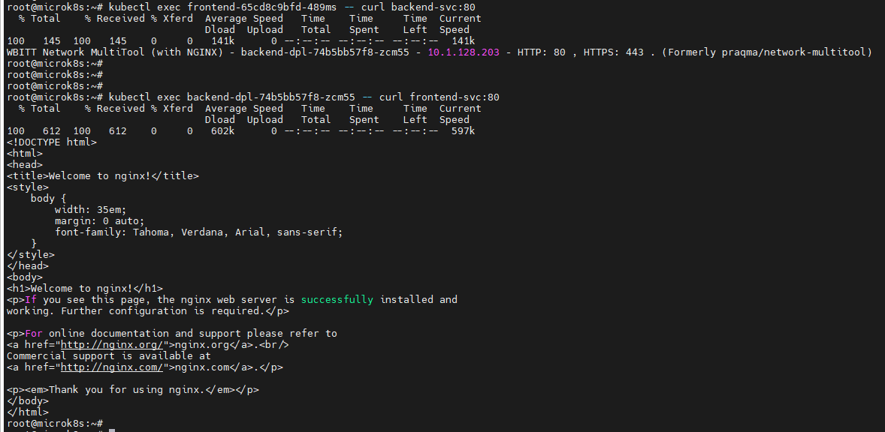
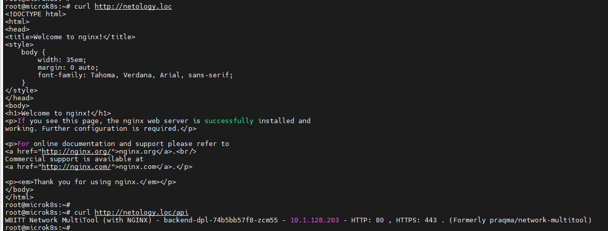
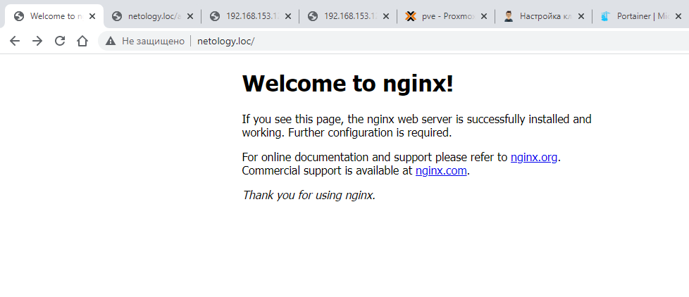
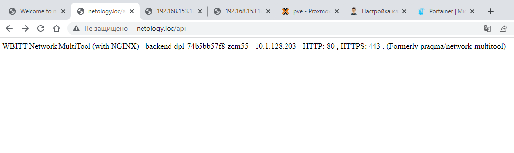

# Домашнее задание к занятию "12.5  1.5 "Сетевое взаимодействие в K8S. Часть 2"

## Задание 1 - Создать Deployment приложений backend и frontend

1. Deployment приложения frontend из образа nginx с количеством реплик 3 шт.:

[deployment-frontend.yaml](/kubernetes/deployment-frontend.yaml)

2. Deployment приложения backend из образа multitool.:

[deployment-backend.yaml](/kubernetes/deployment-backend.yaml)

3. Service, которые обеспечат доступ к обоим приложениям внутри кластера.

- уже содержится внутри деплоймента:
[deployment-frontend.yaml](/kubernetes/deployment-frontend.yaml)
[deployment-backend.yaml](/kubernetes/deployment-backend.yaml)

4. Демонстрация видимости приложений с помощью Service:

```bash
root@microk8s:~# kubectl get deployments
NAME          READY   UP-TO-DATE   AVAILABLE   AGE
frontend      3/3     3            3           2d23h
backend-dpl   1/1     1            1           46h

root@microk8s:~# kubectl get pods -n default -o wide
NAME                           READY   STATUS    RESTARTS      AGE   IP             NODE       NOMINATED NODE   READINESS GATES
frontend-65cd8c9bfd-489ms      1/1     Running   1 (40h ago)   42h   10.1.128.241   microk8s   <none>           <none>
frontend-65cd8c9bfd-n2d6x      1/1     Running   1 (40h ago)   42h   10.1.128.213   microk8s   <none>           <none>
frontend-65cd8c9bfd-nwskz      1/1     Running   1 (40h ago)   42h   10.1.128.193   microk8s   <none>           <none>
backend-dpl-74b5bb57f8-zcm55   1/1     Running   0             17h   10.1.128.203   microk8s   <none>           <none>

root@microk8s:~# kubectl get svc -o wide
NAME           TYPE        CLUSTER-IP       EXTERNAL-IP   PORT(S)   AGE     SELECTOR
kubernetes     ClusterIP   10.152.183.1     <none>        443/TCP   5d23h   <none>
frontend-svc   ClusterIP   10.152.183.96    <none>        80/TCP    2d23h   app=frontend
backend-svc    ClusterIP   10.152.183.136   <none>        80/TCP    46h     app=backend

root@microk8s:~# kubectl exec backend-dpl-74b5bb57f8-zcm55 -- curl frontend-svc:80
  % Total    % Received % Xferd  Average Speed   Time    Time     Time  Current
                                 Dload  Upload   Total   Spent    Left  Speed
100   612  100   612    0     0   6162      0 --:--:-- --:--:-- --:--:--  597k
<!DOCTYPE html>
<html>
<head>
<title>Welcome to nginx!</title>
<style>
    body {
        width: 35em;
        margin: 0 auto;
        font-family: Tahoma, Verdana, Arial, sans-serif;
    }
</style>
</head>
<body>
<h1>Welcome to nginx!</h1>
<p>If you see this page, the nginx web server is successfully installed and
working. Further configuration is required.</p>

<p>For online documentation and support please refer to
<a href="http://nginx.org/">nginx.org</a>.<br/>
Commercial support is available at
<a href="http://nginx.com/">nginx.com</a>.</p>

<p><em>Thank you for using nginx.</em></p>
</body>
</html>


root@microk8s:~# kubectl exec frontend-65cd8c9bfd-489ms -- curl backend-svc:80
  % Total    % Received % Xferd  Average Speed   Time    Time     Time  Current
                                 Dload  Upload   Total   Spent    Left  Speed
  0     0    0     0    0     0      0      0 --:--:-- --:--:-- --:--:--     0
100   145  100   145    0     0   141k      0 --:--:-- --:--:-- --:--:--  141k
WBITT Network MultiTool (with NGINX) - backend-dpl-74b5bb57f8-zcm55 - 10.1.128.203 - HTTP: 80 , HTTPS: 443 . (Formerly praqma/network-multitool)

```

5. Манифесты Deployment и Service в решении и скриншоты или вывод команды п.4.

[deployment-frontend.yaml](/kubernetes/deployment-frontend.yaml)
[deployment-backend.yaml](/kubernetes/deployment-backend.yaml)



## Задание 2 - Создать Ingress и обеспечить доступ к приложениям снаружи кластера

1. Включить Ingress-controller в MicroK8S:

```bash
root@microk8s:~# microk8s enable ingress
Infer repository core for addon ingress
Enabling Ingress
ingressclass.networking.k8s.io/public created
ingressclass.networking.k8s.io/nginx created
namespace/ingress created
serviceaccount/nginx-ingress-microk8s-serviceaccount created
clusterrole.rbac.authorization.k8s.io/nginx-ingress-microk8s-clusterrole created
role.rbac.authorization.k8s.io/nginx-ingress-microk8s-role created
clusterrolebinding.rbac.authorization.k8s.io/nginx-ingress-microk8s created
rolebinding.rbac.authorization.k8s.io/nginx-ingress-microk8s created
configmap/nginx-load-balancer-microk8s-conf created
configmap/nginx-ingress-tcp-microk8s-conf created
configmap/nginx-ingress-udp-microk8s-conf created
daemonset.apps/nginx-ingress-microk8s-controller created
Ingress is enabled
```

2. Создаем Ingress, обеспечивающий доступ снаружи по IP-адресу кластера MicroK8S так, чтобы при запросе только по адресу открывался frontend а при добавлении /api - backend.

[ingress.yaml](/kubernetes/ingress.yaml)

3. Демонстрация доступа:

```bash
root@microk8s:~# curl http://localhost
<!DOCTYPE html>
<html>
<head>
<title>Welcome to nginx!</title>
<style>
    body {
        width: 35em;
        margin: 0 auto;
        font-family: Tahoma, Verdana, Arial, sans-serif;
    }
</style>
</head>
<body>
<h1>Welcome to nginx!</h1>
<p>If you see this page, the nginx web server is successfully installed and
working. Further configuration is required.</p>

<p>For online documentation and support please refer to
<a href="http://nginx.org/">nginx.org</a>.<br/>
Commercial support is available at
<a href="http://nginx.com/">nginx.com</a>.</p>

<p><em>Thank you for using nginx.</em></p>
</body>
</html>


root@microk8s:~# curl http://localhost/api
WBITT Network MultiTool (with NGINX) - backend-dpl-74b5bb57f8-zcm55 - 10.1.128.203 - HTTP: 80 , HTTPS: 443 . (Formerly praqma/network-multitool)
```

4. Манифесты и скриншоты или вывод команды п.2:

[ingress.yaml](/kubernetes/ingress.yaml)

```bash
root@microk8s:~# kubectl describe ingress
Name:             netology-ingress
Labels:           <none>
Namespace:        default
Address:          127.0.0.1
Ingress Class:    nginx
Default backend:  frontend-svc:80 (10.1.128.193:80,10.1.128.213:80,10.1.128.241:80)
Rules:
  Host        Path  Backends
  ----        ----  --------
  *
              /               frontend-svc:80 (10.1.128.193:80,10.1.128.213:80,10.1.128.241:80)
              /api(/|$)(.*)   backend-svc:80 (10.1.128.200:80)
Annotations:  nginx.ingress.kubernetes.io/rewrite-target: /$2
              nginx.ingress.kubernetes.io/use-regex: true
Events:       <none>
```



- 
 


-


