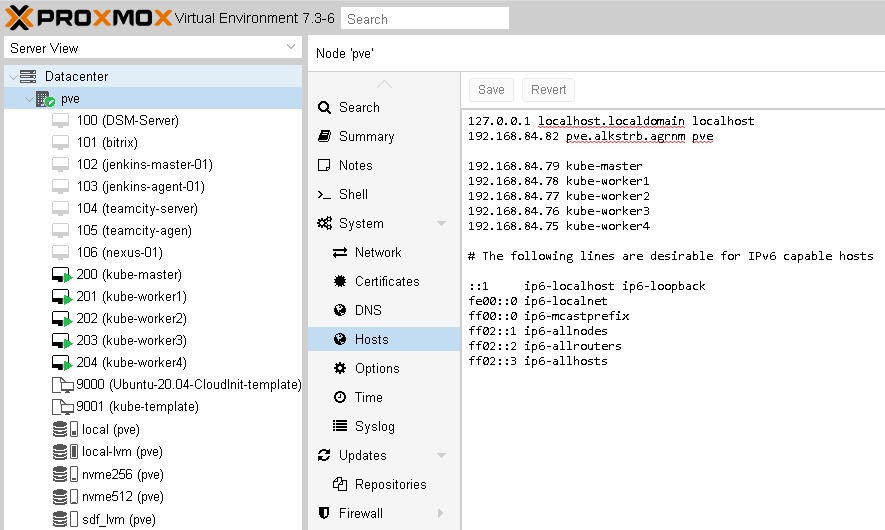
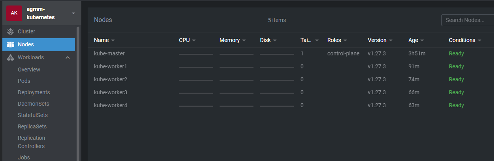
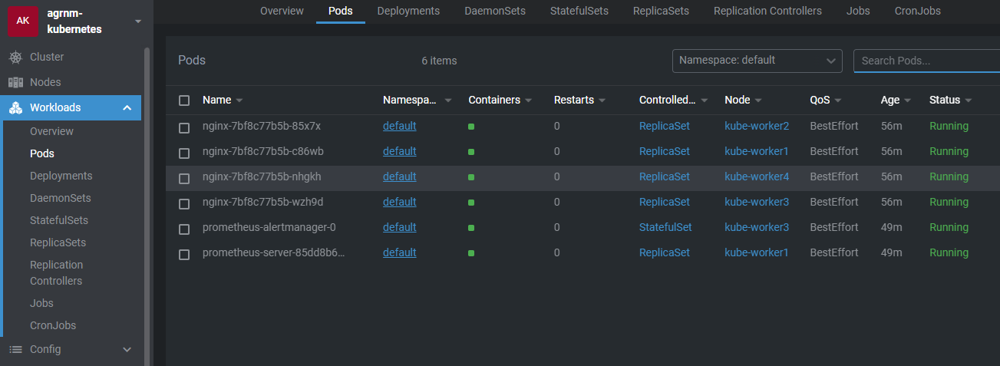
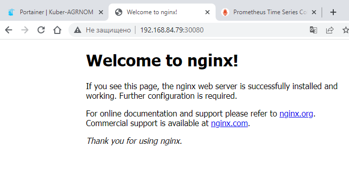

# Домашнее задание к занятию "3.2 Установка Kubernetes"

## Задание 1 - Установить кластер k8s с 1 master node

1. Подготовка работы кластера из 5 нод: 1 мастер и 4 рабочие ноды:

- подготовим 5 ВМ на гипервизоре ProxMox

```bash
wget https://cloud-images.ubuntu.com/focal/current/focal-server-cloudimg-amd64.img
qm create 9000 --memory 2048 --cores 4 --net0 virtio,bridge=vmbr0 --name Ubuntu-20.04-CloudInit-template
qm importdisk 9000 focal-server-cloudimg-amd64.img nvme512
qm set 9000 --scsihw virtio-scsi-pci --scsi0 nvme512:vm-9000-disk-0
qm set 9000 --scsihw virtio-scsi-pci --scsi0 nvme512:9000/vm-9000-disk-0.raw
qm set 9000 --ide2 nvme512:cloudinit
qm set 9000 --boot c --bootdisk scsi0
qm set 9000 --serial0 socket --vga serial0
qm template 9000
qm clone 9000 9001 --name kube-template --full --storage nvme512
qm set 9001 --memory 4096 --agent enabled=1
qm resize 9001 scsi0 3G
sudo apt-get install qemu-guest-agent
qm template 9001
...
qm clone 9001 200 --name kube-master --full --storage nvme512
qm resize 200 scsi0 15G
```

```bash
root@pve:~# qm list
      VMID NAME                 STATUS     MEM(MB)    BOOTDISK(GB) PID
       200 kube-master          running    4096              15.00 54840
       201 kube-worker1         running    4096              40.00 79046
       202 kube-worker2         running    4096              40.00 80930
       203 kube-worker3         running    4096              40.00 81605
       204 kube-worker4         running    4096              40.00 82165
```

- настраиваем видимость машин

```bash
root@kube-master:~# cat /etc/hosts
#
127.0.1.1 kube-master kube-master
127.0.0.1 localhost
192.168.84.79 kube-master
192.168.84.78 kube-worker1
192.168.84.77 kube-worker2
192.168.84.76 kube-worker3
192.168.84.75 kube-worker4
```



2. Устанавливаем компоненты кластера:

- Буду использовать способ установки инструментом "kubeadm"

```bash
root@kube-master:~# apt install apt-transport-https ca-certificates curl
Reading package lists... Done
Building dependency tree
Reading state information... Done
ca-certificates is already the newest version (20230311ubuntu0.20.04.1).
ca-certificates set to manually installed.
curl is already the newest version (7.68.0-1ubuntu2.18).
curl set to manually installed.
The following NEW packages will be installed:
  apt-transport-https
0 upgraded, 1 newly installed, 0 to remove and 0 not upgraded.
Need to get 1704 B of archives.
After this operation, 162 kB of additional disk space will be used.
Do you want to continue? [Y/n] y
Get:1 http://archive.ubuntu.com/ubuntu focal-updates/universe amd64 apt-transport-https all 2.0.9 [1704 B]
Fetched 1704 B in 0s (3955 B/s)
[wait-control-plane] Waiting for the kubelet to boot up the control plane as static Pods from directory "/etc/kubernetes/manifests". This can take up to 4m0s
[apiclient] All control plane components are healthy after 7.002369 seconds
[upload-config] Storing the configuration used in ConfigMap "kubeadm-config" in the "kube-system" Namespace
[kubelet] Creating a ConfigMap "kubelet-config" in namespace kube-system with the configuration for the kubelets in the cluster
[upload-certs] Skipping phase. Please see --upload-certs
[mark-control-plane] Marking the node kube-master as control-plane by adding the labels: [node-role.kubernetes.io/control-plane node.kubernetes.io/exclude-from-e                       xternal-load-balancers]
[mark-control-plane] Marking the node kube-master as control-plane by adding the taints [node-role.kubernetes.io/control-plane:NoSchedule]
[bootstrap-token] Using token: 0kmi2z.u87ug4tsvqhf9i68
[bootstrap-token] Configuring bootstrap tokens, cluster-info ConfigMap, RBAC Roles
[bootstrap-token] Configured RBAC rules to allow Node Bootstrap tokens to get nodes
[bootstrap-token] Configured RBAC rules to allow Node Bootstrap tokens to post CSRs in order for nodes to get long term certificate credentials
[bootstrap-token] Configured RBAC rules to allow the csrapprover controller automatically approve CSRs from a Node Bootstrap Token
[bootstrap-token] Configured RBAC rules to allow certificate rotation for all node client certificates in the cluster
[bootstrap-token] Creating the "cluster-info" ConfigMap in the "kube-public" namespace
[kubelet-finalize] Updating "/etc/kubernetes/kubelet.conf" to point to a rotatable kubelet client certificate and key
[addons] Applied essential addon: CoreDNS
[addons] Applied essential addon: kube-proxy

Your Kubernetes control-plane has initialized successfully!

To start using your cluster, you need to run the following as a regular user:

  mkdir -p $HOME/.kube
  sudo cp -i /etc/kubernetes/admin.conf $HOME/.kube/config
  sudo chown $(id -u):$(id -g) $HOME/.kube/config

Alternatively, if you are the root user, you can run:

  export KUBECONFIG=/etc/kubernetes/admin.conf

You should now deploy a pod network to the cluster.
Run "kubectl apply -f [podnetwork].yaml" with one of the options listed at:
  https://kubernetes.io/docs/concepts/cluster-administration/addons/

Then you can join any number of worker nodes by running the following on each as root:

kubeadm join 192.168.84.79:6443 --token 0kmi2z.u87ug4tsvqhf9i68 \
        --discovery-token-ca-cert-hash sha256:dcff59c2026e9fbf289411fa75b89861d0a894b36eed7d657c3d2a4caaf83e6f
```

- Подключаем ноды:

```bash
root@kube-worker1:~# kubeadm join 192.168.84.79:6443 --token blqttr.ypapjiamjveddb85 --discovery-token-ca-cert-hash sha256:dcff59c2026e9fbf289411fa75b89861d0a894b36eed7d657c3d2a4caaf83e6f
[preflight] Running pre-flight checks
[preflight] Reading configuration from the cluster...
[preflight] FYI: You can look at this config file with 'kubectl -n kube-system get cm kubeadm-config -o yaml'
[kubelet-start] Writing kubelet configuration to file "/var/lib/kubelet/config.yaml"
[kubelet-start] Writing kubelet environment file with flags to file "/var/lib/kubelet/kubeadm-flags.env"
[kubelet-start] Starting the kubelet
[kubelet-start] Waiting for the kubelet to perform the TLS Bootstrap...

This node has joined the cluster:
* Certificate signing request was sent to apiserver and a response was received.
* The Kubelet was informed of the new secure connection details.

Run 'kubectl get nodes' on the control-plane to see this node join the cluster.
```

- повторяем на остальных рабочих нодах

- проверяем результат:

```bash
root@kube-master:~# kubectl get nodes
NAME           STATUS   ROLES           AGE     VERSION
kube-master    Ready    control-plane   3h46m   v1.27.3
kube-worker1   Ready    <none>          86m     v1.27.3
kube-worker2   Ready    <none>          68m     v1.27.3
kube-worker3   Ready    <none>          61m     v1.27.3
kube-worker4   Ready    <none>          58m     v1.27.3
```

```bash
root@kube-master:~# kubectl get all --all-namespaces
NAMESPACE      NAME                                      READY   STATUS    RESTARTS   AGE
default        pod/nginx-7bf8c77b5b-85x7x                1/1     Running   0          46m
default        pod/nginx-7bf8c77b5b-c86wb                1/1     Running   0          46m
default        pod/nginx-7bf8c77b5b-nhgkh                1/1     Running   0          46m
default        pod/nginx-7bf8c77b5b-wzh9d                1/1     Running   0          46m
default        pod/prometheus-alertmanager-0             1/1     Running   0          39m
default        pod/prometheus-server-85dd8b66db-tvtkh    1/1     Running   0          39m
kube-flannel   pod/kube-flannel-ds-fk9qj                 1/1     Running   0          64m
kube-flannel   pod/kube-flannel-ds-lpr9q                 1/1     Running   0          106m
kube-flannel   pod/kube-flannel-ds-nvzqd                 1/1     Running   0          56m
kube-flannel   pod/kube-flannel-ds-p9bbt                 1/1     Running   0          53m
kube-flannel   pod/kube-flannel-ds-vqf7t                 1/1     Running   0          81m
kube-system    pod/coredns-5d78c9869d-5vhjr              1/1     Running   0          3h41m
kube-system    pod/coredns-5d78c9869d-jkbd7              1/1     Running   0          3h41m
kube-system    pod/etcd-kube-master                      1/1     Running   0          3h41m
kube-system    pod/kube-apiserver-kube-master            1/1     Running   0          3h41m
kube-system    pod/kube-controller-manager-kube-master   1/1     Running   0          3h41m
kube-system    pod/kube-proxy-5ngxc                      1/1     Running   0          64m
kube-system    pod/kube-proxy-6kxpd                      1/1     Running   0          3h41m
kube-system    pod/kube-proxy-fbjb9                      1/1     Running   0          56m
kube-system    pod/kube-proxy-fmj2d                      1/1     Running   0          81m
kube-system    pod/kube-proxy-kc8cp                      1/1     Running   0          53m
kube-system    pod/kube-scheduler-kube-master            1/1     Running   0          3h41m
portainer      pod/portainer-agent-7f8c6dd885-w4jgg      1/1     Running   0          52m

NAMESPACE     NAME                               TYPE           CLUSTER-IP       EXTERNAL-IP   PORT(S)                  AGE
default       service/kubernetes                 ClusterIP      10.96.0.1        <none>        443/TCP                  3h41m
default       service/nginx                      ClusterIP      10.105.30.13     <none>        20080/TCP                43m
default       service/nginx-2                    NodePort       10.109.182.203   <none>        80:30080/TCP             42m
default       service/prometheus-alertmanager    LoadBalancer   10.104.69.196    <pending>     80:32230/TCP             39m
default       service/prometheus-server          LoadBalancer   10.101.154.56    <pending>     80:32077/TCP             39m
kube-system   service/kube-dns                   ClusterIP      10.96.0.10       <none>        53/UDP,53/TCP,9153/TCP   3h41m
portainer     service/portainer-agent            NodePort       10.102.141.107   <none>        9001:30778/TCP           73m
portainer     service/portainer-agent-headless   ClusterIP      None             <none>        <none>                   73m

NAMESPACE      NAME                             DESIRED   CURRENT   READY   UP-TO-DATE   AVAILABLE   NODE SELECTOR            AGE
kube-flannel   daemonset.apps/kube-flannel-ds   5         5         5       5            5           <none>                   106m
kube-system    daemonset.apps/kube-proxy        5         5         5       5            5           kubernetes.io/os=linux   3h41m

NAMESPACE     NAME                                READY   UP-TO-DATE   AVAILABLE   AGE
default       deployment.apps/nginx               4/4     4            4           46m
default       deployment.apps/prometheus-server   1/1     1            1           39m
kube-system   deployment.apps/coredns             2/2     2            2           3h41m
portainer     deployment.apps/portainer-agent     1/1     1            1           73m

NAMESPACE     NAME                                           DESIRED   CURRENT   READY   AGE
default       replicaset.apps/nginx-7bf8c77b5b               4         4         4       46m
default       replicaset.apps/prometheus-server-85dd8b66db   1         1         1       39m
kube-system   replicaset.apps/coredns-5d78c9869d             2         2         2       3h41m
portainer     replicaset.apps/portainer-agent-7759b947bd     0         0         0       73m
portainer     replicaset.apps/portainer-agent-7f8c6dd885     1         1         1       52m

NAMESPACE   NAME                                       READY   AGE
default     statefulset.apps/prometheus-alertmanager   1/1     39m

```

4. Пробуем развернуть приложение:

```bash
root@kube-master:~# kubectl create deploy nginx --image=nginx:latest --replicas=4
deployment.apps/nginx created

root@kube-master:~# kubectl get pod -o wide
NAME                                 READY   STATUS    RESTARTS   AGE   IP           NODE           NOMINATED NODE   READINESS GATES
nginx-7bf8c77b5b-85x7x               1/1     Running   0          55m   10.244.2.3   kube-worker2   <none>           <none>
nginx-7bf8c77b5b-c86wb               1/1     Running   0          55m   10.244.1.3   kube-worker1   <none>           <none>
nginx-7bf8c77b5b-nhgkh               1/1     Running   0          55m   10.244.4.2   kube-worker4   <none>           <none>
nginx-7bf8c77b5b-wzh9d               1/1     Running   0          55m   10.244.3.2   kube-worker3   <none>           <none>
```



-



-


